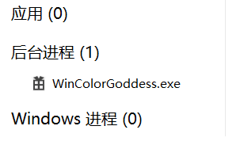
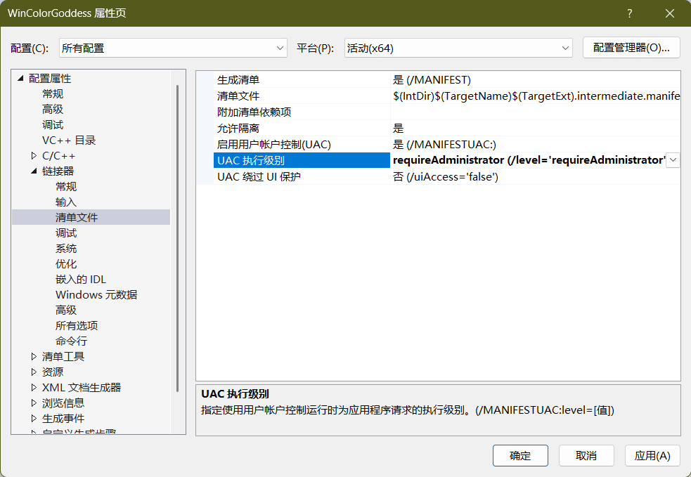

# 视窗颜色主题女神
### WinColorGoddess auto ctrl win theme

## 运行在后台

- 静默运行
- 开机自启
- 根据时间调整**主题深浅**和**壁纸组**

#### 关于壁纸组
如果你喜欢 **Windows壁纸幻灯片放映** 模式

- E:\媒体\壁纸\\-day

- E:\媒体\壁纸\\-night

文件夹分别存放 **日间** 和 **夜间** 壁纸，WinColorGoddess将根据时间自动选择

## 开始使用

下载 **Release.7z** 解压到合适位置并运行

## 继续开发
> [!NOTE]
> ### 准备工作
> - 含有 **c++** 环境的 **Visual Studio**
> - 没有更多了

- #### 1. 创建新项目
  
  选择Windows桌面应用程序
  
- #### 2. 命名
  
  WinColorGoddess
  
- #### 3. 写
  
  复制本源码覆盖默认代码

- #### 4. 完成
  
  在顶部选择debug或release，然后运行

> [!NOTE]
> #### 哦对，忘记告诉你
> 由于程序需要修改注册表和系统设置，必须确保它以 ​​管理员权限​​ 运行：
> 
> 右键项目 → ​​"属性"​​（Properties）
> 
> 进入 ​​"链接器" → "清单文件"​​（Linker → Manifest File）
> 
> 设置 ​​"UAC 执行级别"​​（UAC Execution Level）为 ​​requireAdministrator​​（要求管理员权限）
> 
> 点击 ​​"应用"​​ 并关闭

#### 就像这样

